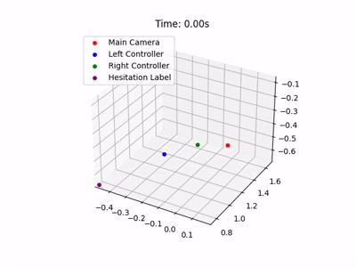

# Motion Tracker VR Application

  

This project is a VR-based motion tracking system designed for experiments involving human motion data collection. The application is built using Unity and the XR Interaction Toolkit and is compatible with the Meta Quest 3 headset.  

## Features
- **Motion Data Recording**  
  Tracks the position and rotation of the VR headset and left and right hand controllers.  
- **Data Export**  
  Exports motion data in CSV format for post-experiment analysis.  
- **3D Motion Visualization**  
  Provides visualizations of recorded motion data as 3D videos.  
- **User Interaction**  
  Start and finish recording buttons are activated via hand-controller interactions.  

## Requirements
- Unity 2022 or newer 
- XR Interaction Toolkit  
- VR headset and controllers  
- [UXF (Unity Experiment Framework)](https://github.com/immersivecognition/unity-experiment-framework)  

## Installation
1. Clone this repository to your local machine.  
2. Open the project in Unity (2022 or newer).
3. Connect your VR headset.
4. Build and run the project to deploy it to your device.
5. (Optional) run the ./Visualization/visualize.ipynb to visualize motion data as 3D videos.

